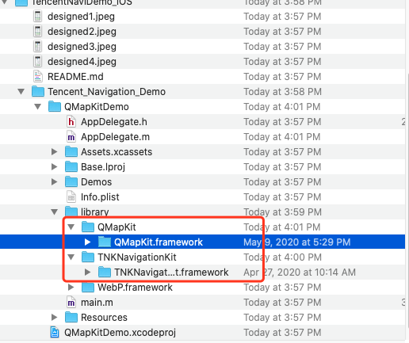
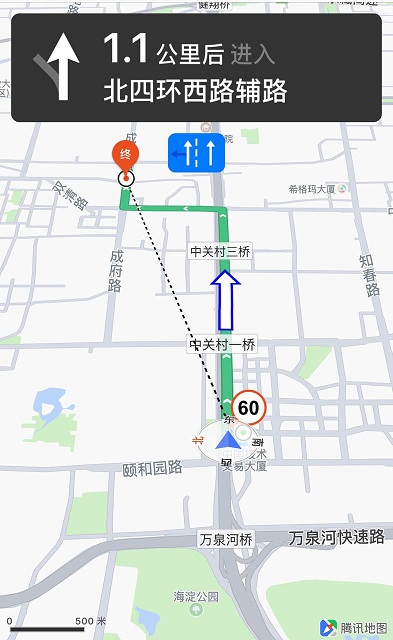
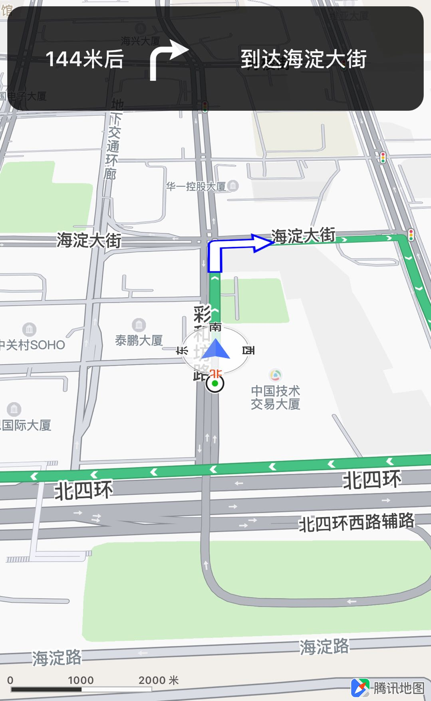
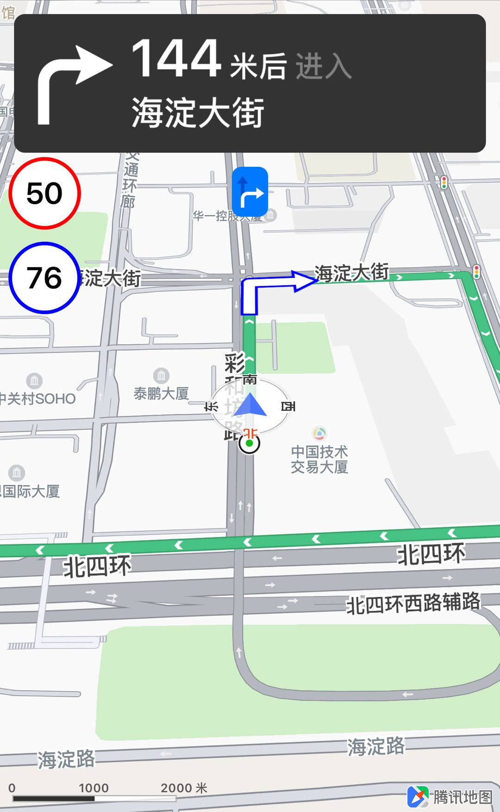

# 目录
- [工程配置](#ProjectConfig)
- [驾车路径规划](#NaviPlan)
- [导航](#Navi)
- [导航设置](#NaviConfig)
- [获取导航数据](#NaviData)
- [自定义UI](#UIDesign)

### 介绍
腾讯导航SDK是一款针对在线导航的产品。该产品能够结合实时交通信息计算路径，并且提供路径规划、模拟导航、实时导航、导航设置、自定义导航界面等功能，力求为用户提供更加人性化的导航服务。

<div id="ProjectConfig"></div>

### 工程配置

#### 1. 权限申请
(1) 若使用实时导航，则需要在`info.list`中添加NSLocationWhenInUseUsageDescriptionh和NSLocationAlwaysUsageDescription字段。

(2) 如果需要后台定位，需在IOS 9.0及以后设置allowBackgroundLocationUpdates为YES，此时必须保证`TARGETS->Capabilities->Background Modes->Location updates`处于选中状态。

#### 2. 引入SDK
在`TARGETS->Build Phases->Link Binary Libraries`中添加`WebP.framework`、导航SDK`TNKNavigationKit.framework`，在`TARGETS->Build Phases->Copy Bundle Resources`中添加资源文件`TencentNavigationKit.bundle`。

在library目录下，新建QMapKit目录和TNKNavigationKit目录，并且把对应的地图sdk和导航sdk放到该目录下，


由于导航SDK依赖地图SDK，还需要依照[http://lbs.qq.com/ios_v1/guide-project-setup.html](http://lbs.qq.com/ios_v1/guide-project-setup.html)添加地图SDK。
从导航SDK v5.2.2版本开始必须引入定位SDK (v4.9.5及其以上版本)，该定位SDK可以和腾讯的同学联系给出。
#### 3. 申请和设置开发密钥
前往[http://lbs.qq.com/console/mykey.html](http://lbs.qq.com/console/mykey.html)申请开发密钥，分别在QMapServices和TNKNaviServices的APIKey属性上设置。
```objc
[QMapServices sharedServices].APIKey = @"您的key";
[TNKNaviServices sharedServices].APIKey = @"您的key"
```


<div id="NaviPlan"></div>

### 驾车路径规划

#### 基本介绍
`TNKCarNaviManager`根据起点、终点、途经点以及路径策略，为用户提供出行路线。方法：
```objc
- (TNKSearchTask *)searchNavigationRoutesWithRequest:(TNKCarRouteSearchRequest *)request completion:(void (^)(TNKCarRouteSearchResult *result, NSError *error))callback;
```
参数：

- request：路线规划请求，包括起点、终点、途经点（可选）、规划参数（可选）
- callback：路线规划完成回调

`TNKCarRouteSearchRequest`包含下列属性：

- startPoint：起点
- destinationPoint：终点
- wayPoints：途经点，数量不超过3个，可为空
- searchOption：路线规划配置项，不可为空

**路线规划请求参数说明**

通过searchOption，可以配置是否避开收费道路、是否避开高速道路、是否结合路况、导航场景、起点路段类型。默认配置是不避开收费道路、不避开高速道路、不结合路况、接客模式、无详细起点路段类型。

算路配置方法概览：
```
BOOL avoidToll：设置是否避开收费道路
BOOL avoidHighway：设置是否避开高速道路
BOOL avoidTrafficJam：设置是否结合路况
int navScene：设置导航场景，1表示接客，2表示送客
TNKStartRoadType startRoadType：使用枚举设置起点路段类型，TNKStartRoadType_None为无详细类型，TNKStartRoadType_Elevated为在桥上，TNKStartRoadType_Downstairs为在桥下，TNKStartRoadType_MainRoad为在主路，TNKStartRoadType_ServingRoad为在辅路，TNKStartRoadType_DirectionRoad为在对面，TNKStartRoadType_DownstairsMainRoad为在桥下主路，TNKStartRoadType_DownstairsServingRoad为在桥下辅路
```
**算路失败回调错误说明**

回调NSError的错误码：

- 1001：网络错误
- 2001：返回数据无效
- 2002：起终点参数错误
- 2003：途经点参数错误
- 2004：吸附失败
- 2005：算路失败
- 2999：服务器内部错误

#### 示例
```objc
// 初始化
self.carManager = [[TNKCarNaviManager alloc] init];
//起点
TNKSearchNaviPoi *start = [[TNKSearchNaviPoi alloc] init];
CLLocationCoordinate2D startPoi = {39.9842, 116.3074};
start.coordinate = startPoi;
//终点    
TNKSearchNaviPoi *dest  = [[TNKSearchNaviPoi alloc] init];
CLLocationCoordinate2D endPoi = {39.9930, 116.3376};
dest.coordinate = endPoi;
// 路线规划配置项
TNKCarRouteSearchOption *option = [[TNKCarRouteSearchOption alloc] init];
option.avoidTrafficJam = YES; //设置结合路况
option.avoidHighway = YES;//设置不走高速

TNKCarRouteSearchRequest *request = [[TNKCarRouteSearchRequest alloc] init];
request.startPoint = start;
request.destinationPoint = dest;
request.searchOption = option;
//设置途经点
NSMutableArray<TNKSearchNaviPoi*> *wayPoints = [NSMutableArray array];
//设置第一个途经点
[wayPoints addObject:[[TNKSearchNaviPoi alloc]init]];
wayPoints[0].coordinate = CLLocationCoordinate2DMake(39.9841, 116.3163);
//设置第二个途经点
[wayPoints addObject:[[TNKSearchNaviPoi alloc]init]];
wayPoints[1].coordinate = CLLocationCoordinate2DMake(39.9894, 116.3271);
request.wayPoints = wayPoints;

[self.carManager searchNavigationRoutesWithRequest:request completion:^(TNKCarRouteSearchResult *result, NSError *error) {
//获取路线数据result，包含多条线路。
}];
```
**驾车路线**

路线规划获取的`TNKCarRouteSearchResult`包含属性：
```
NSArray<TNKCarRouteSearchRoutePlan *> *routes
```
可以通过`TNKCarRouteSearchRoutePlan`获取各条线路的信息，TNKCarRouteSearchPlan包含以下属性：

- totalDistance：总距离
- totalTime：总预计时间
- recommendReason：推荐理由
- line：路线数据，包含起终点、途经点、道路信息的坐标点串等

<div id="Navi"></div>

### 导航

#### 基本介绍
腾讯导航SDK提供了实时导航和模拟导航，实时导航是基于用户真实的定位信息来驱动的导航过程，模拟导航是基于线路模拟点驱动的导航过程，路线规划完成后就可以开始导航。
方法：

- 开启实时导航：startWithIndex:(NSUInteger)index，路线规划成功后，根据索引index选择路线。
- 开启模拟导航：startSimulateWithIndex:(NSUInteger)index
locationEntry:(id <TNKLocationEntry> __nullable)locationEntry，路线规划成功后，根据index索引选择路线，locationEntry是用户自定义的数据源入口，当locationEntry为nil时会自动使用路径规划的数据。
- 停止实时导航：stop。

**导航界面**

腾讯导航SDK提供了默认的导航界面`TNKCarNaviView`，包括导航面板，导航地图：

导航面板：

- 导航Title：转向箭头、距离下一转弯时间的距离、下一条道路名称
- 车道线
- 电子眼放大图
- 路口放大图

导航地图：

- 地图
- 线路：蚯蚓线、当前道路名称、道路指示箭头
- 起点、终点、途经点marker
- 车标
- 罗盘
- 电子眼

导航地图可以通过`self.carNaviView.naviMapView`获取。


#### 使用说明

**1. 初始化**

导航过程中，导航SDK提供类TNKCarNaviView用于显示导航界面，由驾车导航控制类TNKCarNaviManager设置导航状态回调，调用驾车路线规划，启动/停止导航，设置路口方法图/车道线加载资源等。
初始化过程如下：
```objc
self.carManager = [[TNKCarNaviManager alloc] init];
// self需采用TNKCarNaviDelegate协议，通过该协议获取导航过程中出现的状态或信息改变（如已偏航、经过途经点、到达等）
[self.carManager registerNaviDelegate:self];

self.carNaviView = [[TNKCarNaviView alloc] initWithFrame:self.view.bounds];
// self需采用TNKCarNaviViewDelegate协议，通过该协议接收导航模式、日夜状态的变化
self.carNaviView.delegate = self;

//注册采用TNKCarNaviUIDelegate协议的对象，通过该协议获取导航面板所需数据，可注册多个对象接收数据更新
[self.carManager registerUIDelegate:self.carNaviView];
```

**2. 发起路线规划**

具体参考[驾车路径规划](#NaviPlan)。

**3. 开始导航**

路线规划成功后，在回调中获取用于导航的线路。
```objc
[self.carManager searchNavigationRoutesWithRequest:request completion:^(TNKCarRouteSearchResult *result, NSError *error) {
if(error == nil)
{
//获取线路数据后使用第一条线路进行导航
[self.carManager startWithIndex:0];
//模拟导航使用[self.carManager startSimulateWithIndex:0 locationEntry:nil];
}
}];
```
**4. 结束导航**

到达终点后需手动结束导航并且注销代理：
```objc
[self.carManager unregisterUIDelegate:self.carNaviView];
[self.carManager unregisterUIDelegate:self];
[self.carManager stop];
```
非导航状态下，用户可以清除导航线路相关UI，包括导航路线、自车点以及动态添加的限速等标注：（非导航状态下调用无效）
```objc
[self.carNaviView clearAllRouteUI];
```

<div id="NaviConfig"></div>

### 导航设置

腾讯导航SDK提供导航模式、日夜模式等界面的动态设置，这些设置都是即时生效的。
#### 设施导航模式
通过`TNKCarNaviView`的属性mode进行设置:

- TNKCarNaviUIModeBounce：默认值，回弹模式，导航态中，用户使用手势操作地图后进入该模式，手势结束5秒后切换回之前的导航模式，直接设置为该模式不会被响应。
- TNKCarNaviUIMode3DCarTowardsUp：3D车头朝上模式，该模式下，车头始终保持指向屏幕上方，地图进行旋转并动态调整缩放级别；
- TNKCarNaviUIMode2DMapTowardsNorth：2D地图朝北模式，该模式下，车头进行旋转，地图保持上北下南并动态调整缩放级别；
- TNKCarNaviUIModeOverview：全览模式，该模式下车头进行旋转，地图保持上北下南，同时会始终展示整条导航路线。

设置过程：
```objc
self.carNaviView.mode = TNKCarNaviUIMode3DCarTowardsUp;
```

**设置导航日夜模式**

通过`TNKCarNaviView`的属性dayNightMode设置日夜模式，默认为自动切换模式，可以通过dayNightStatus获取地图当前日夜状态。

日夜切换模式TNKCarNaviDayNightMode：

- TNKCarNaviDayNightModeAuto：自动切换模式，导航SDK通过对当前时间和经纬度的判断切换到日间或夜间状态；
- TNKCarNaviDayNightModeAlwaysDay：始终日间；
- TNKCarNaviDayNightModeAlwaysNight：始终夜间；

日夜状态dayNightStatus：

- TNKCarNaviDayNightStatusDay：白天
- TNKCarNaviDayNightStatusNight：黑夜

设置过程：
```objc
self.carNaviView.dayNightMode = TNKCarNaviDayNightModeAlwaysDay;
```
**设置导航面板**

用户可以设定默认导航面板、车道线、路口放大图是否显示。
```objc
// 设置默认面板（包含导航面板、车道线、路口放大图）的总开关
self.carNaviView.hideNavigationPanel = NO;
// 路口放大图开关
self.carManager.enableEnlargedIntersection = YES;
// 车道线开关  
self.carManager.enableGuidedLane = YES;
```
**设置导航线路**
```objc
// 设置导航路线宽度，默认值为12px
self.carNaviView.routeLineWidth = 10;
// 设置已走过路线的处理方式，0为置灰，1为擦除，默认为0
self.carNaviView.routeLineEraseType = 0;
```

**设置车标位置**
```objc
// 设置3D导航模式下车标位于地图宽高的比例，默认x为0.5，y为0.75，取值范围为[0.25, 0.75]，超过则取默认值
self.carNaviView.TNKCarNaviFixCarProportion2D = CGPointMake(0.5, 0.75);
// 设置2D导航模式下车标位于地图宽高的比例，默认x为0.5，y为0.75，取值范围为[0.25, 0.75]，超过则取默认值
self.carNaviView.TNKCarNaviFixCarProportion3D = CGPointMake(0.5, 0.75);
```

<div id="NaviData"></div>

### 获取导航数据

#### 面板数据
用户若需要自定义导航面板，可以通过采用`TNKCarNaviUIDelegate`协议获取面板数据，TNKCarNaviManager可同时注册多个对象接收更新：
```objc
// 获取导航数据，包括当前道路名称、当前道路剩余距离、当前速度、总剩余距离、总剩余时间、下一条道路名称等
- (void)carNavigationManager:(TNKCarNaviManager *)manager updateNavigationData:(TNKCarNavigationData *)data;
// 获取路口放大图
- (void)carNavigationManager:(TNKCarNaviManager *)manager showEnlargedIntersectionImage:(UIImage *)image;
// 隐藏路口放大图
- (void)carNavigationManagerHideEnlargedIntersectionImage:(TNKCarNaviManager *)manager;
// 获取车道线资源
- (void)carNavigationManager:(TNKCarNaviManager *)manager showGuidedLaneImage:(UIImage *)image;
// 隐藏车道线
- (void)carNavigationManagerHideGuidedLaneImage:(TNKCarNaviManager *)manager;
// 获取路况全览进度条数据，包括总长度、剩余长度、路况单元列表
- (void)carNavigationManager:(TNKCarNaviManager *)manager updateRouteTrafficStatus:(TNKRouteTrafficStatus *)status;
```
注册过程为：
```objc
[self.carManager registerUIDelegate:self.carNaviView];
```
#### 导航模式
用户可以采用`TNKCarNaviViewDelegate`协议获取导航模式和日夜模式改变信息：
```objc
// 获取导航模式改变回调
- (void)carNaviView:(TNKCarNaviView *)carNaviView didChangeUIMode:(TNKCarNaviUIMode)mode;
// 获取日夜状态改变回调
- (void)carNaviView:(TNKCarNaviView *)carNaviView didChangeDayNightStatus:(TNKCarNaviDayNightStatus)status;
```
注册过程为：
```objc
self.carNaviView.naviMapView.delegate = self;
```
#### 导航状态数据
用户可以采用`TNKCarNaviDelegate`协议获取导航过程中出现的状态信息：
```objc
// 导航开始回调
- (void)carNavigationManagerDidStart:(TNKCarNaviManager *)manager;
// 导航结束回调
- (void)carNavigationManagerDidStop:(TNKCarNaviManager *)manager;
// 获取语音播报文案，返回值为0表示未播报，1为已播报
- (int)carNavigationManager:(TNKCarNaviManager *)manager broadcastTTS:(TNKNaviTTS *)naviTTS;
// 到达终点回调
- (void)carNavigationManagerDidArriveDestination:(TNKCarNaviManager *)manager;
// 偏航回调
- (void)carNavigationManagerDidOffRoute:(TNKCarNaviManager *)manager;
// 到达途经点回调
- (void)carNavigationManager:(TNKCarNaviManager *)manager didArriveWaypoint:(int)index;
// 重新算路请求回调
- (void)carNavigationManager:(TNKCarNaviManager *)manager
didStartRecaculateRoute:(TNKCarNaviManagerRecaculateType)type;
// 重新算路请求成功回调
- (void)carNavigationManager:(TNKCarNaviManager *)manager
didSuccessRecaculateRoute:(TNKCarNaviManagerRecaculateType)type;
// 重新算路请求失败回调
- (void)carNavigationManager:(TNKCarNaviManager *)manager
didFailRecaculateRoute:(TNKCarNaviManagerRecaculateType)type;
```
注册过程为：
```objc
[self.carManager registerUIDelegate:self.carNaviView];
```

<div id="UIDesign"></div>

### 自定义UI

#### 添加地图标注
可以获取TNKCarNaviView的地图实例，通过地图实例操控地图视野、添加路线/标注等；

**1. 获取地图实例**
```objc
// self需采用QMapViewDelegate协议
self.naviView.naviMapView.delegate = self;
```
**2. 添加折线**

实现协议中的mapView: viewForOverlay回调函数：
```objc
- (QOverlayView *)mapView:(QMapView *)mapView viewForOverlay:(id<QOverlay>)overlay
{
if ([overlay isKindOfClass:[QPolyline class]])
{
QPolylineView *polylineView = [[QPolylineView alloc] initWithPolyline:overlay];
// 设置宽度和虚线形状
polylineView.lineWidth   = 2;
NSArray<NSNumber *> *lineDashPattern = [[NSArray alloc] initWithObjects:[[NSNumber alloc] initWithInt:20], [[NSNumber alloc] initWithInt:20], nil];

polylineView.lineDashPattern = lineDashPattern;
polylineView.strokeColor = [UIColor blackColor];

return polylineView;
}

return nil;
}
```
添加折线：
在获取位置的mapView: didUpdateUserLocation: fromHeading回调中添加当前位置到终点的折线：
```objc
- (void)mapView:(QMapView *)mapView didUpdateUserLocation:(QUserLocation *)userLocation fromHeading:(BOOL)fromHeading
{
if(!self.flag)
{
[self startNavi:userLocation.location.coordinate];
self.flag = YES;
}
if(self.polyline != nil) {
[self.naviView.naviMapView removeOverlay:self.polyline];
}
CLLocationCoordinate2D lineCoord[2];
lineCoord[0] = userLocation.location.coordinate;
lineCoord[1] = self.endPoi;
self.polyline = [QPolyline polylineWithCoordinates:lineCoord count:2];
[self.naviView.naviMapView addOverlay:self.polyline];
}
```



#### 添加面板控件
获取的导航数据可以用来添加导航面板控件，自定义导航面板。

**1. 添加控件**
```objc
self.textView = [[UITextField alloc] initWithFrame:CGRectMake(7, 130, 60, 60)];
[self.textView setBackgroundColor:[UIColor whiteColor]];
[self.textView.layer setBorderWidth:3.0];
[self.textView.layer setBorderColor:[UIColor redColor].CGColor];
[self.textView setFont:[UIFont boldSystemFontOfSize:25]];
[self.textView setTextColor:[UIColor blackColor]];
[self.textView.layer setCornerRadius:30];
[self.textView setText:@"200"];
[self.textView setTextAlignment:NSTextAlignmentCenter];
[self.view addSubview:self.textView];


self.textView2 = [[UITextField alloc] initWithFrame:CGRectMake(7, 200, 60, 60)];
[self.textView2 setBackgroundColor:[UIColor whiteColor]];
[self.textView2.layer setBorderWidth:3.0];
[self.textView2.layer setBorderColor:[UIColor blueColor].CGColor];
[self.textView2 setFont:[UIFont boldSystemFontOfSize:25]];
[self.textView2 setTextColor:[UIColor blackColor]];
[self.textView2.layer setCornerRadius:30];
[self.textView2 setText:@"200"];
[self.textView2 setTextAlignment:NSTextAlignmentCenter];
[self.view addSubview:self.textView2];
```

**2. 实现回调**

使用`TNKCarNaviUIDelegate`协议获取数据。
```objc
- (void)carNavigationManager:(TNKCarNaviManager *)manager updateNavigationData:(TNKCarNavigationData *)data
{
[self.textView setText:[[NSString alloc] initWithFormat:@"%i", data.limitSpeed]];
[self.textView2 setText:[[NSString alloc] initWithFormat:@"%i", data.currentSpeed]];
}
```


#### 自定义导航面板
**1. 关闭默认面板**
```objc
self.carNaviView.hideNavigationPanel = YES;
```
**2. 添加面板**
```objc
UIView* backgroundTitleView = [[UIView alloc] initWithFrame:CGRectMake(self.carNaviView.frame.size.width / 2 - 200, 7, 400, 100)];
backgroundTitleView.backgroundColor = [UIColor blackColor];
backgroundTitleView.alpha = 0.8;
backgroundTitleView.layer.cornerRadius = 15;
[self.carNaviView addSubview:backgroundTitleView];

self.textView = [[UITextView alloc] initWithFrame:CGRectMake(30, 30, 90, 70)];
[self.textView setBackgroundColor:[UIColor clearColor]];
[self.textView setFont:[UIFont boldSystemFontOfSize:20]];
[self.textView setTextColor:[UIColor whiteColor]];
[self.textView setTextAlignment:NSTextAlignmentCenter];
[self.textView setText:@"200米后"];
[backgroundTitleView addSubview:self.textView];


self.imageView = [[UIImageView alloc] initWithFrame:CGRectMake(130, 25, 50, 50)];
[self.imageView setBackgroundColor:[UIColor clearColor]];
self.imageView.contentMode = UIViewContentModeScaleAspectFit;
self.imageView.clipsToBounds = YES;
[backgroundTitleView addSubview:self.imageView];

self.textView2 = [[UITextView alloc] initWithFrame:CGRectMake(200, 30, 170, 70)];
[self.textView2 setBackgroundColor:[UIColor clearColor]];
[self.textView2 setTextColor:[UIColor whiteColor]];
[self.textView2 setFont:[UIFont boldSystemFontOfSize:20]];
[self.textView2 setTextAlignment:NSTextAlignmentCenter];

[self.textView2 setText:@"到达苏州街"];
[backgroundTitleView addSubview:self.textView2];
```

**3. 实现回调**

使用`TNKCarNaviUIDelegate`协议获取数据。
```objc
- (void)carNavigationManager:(TNKCarNaviManager *)manager updateNavigationData:(TNKCarNavigationData *)data
{
[self.textView setText:[[NSString alloc] initWithFormat:@"%@%@后", data.nextDistanceLeftString, data.nextDistanceLeftUnit]];
[self.textView2 setText:[[NSString alloc] initWithFormat:@"到达%@", data.nextRoadName]];
[self.imageView setImage:data.intersectionImage];
}
```


#### 自定义资源
如果想要自定义资源，如小车Marker、自车罗盘等，用户可以直接替换`TencentNavigationKit.bundle`中的资源文件，（不能修改资源名称）此时导航SDK在使用时会加载用户提供的资源文件。

